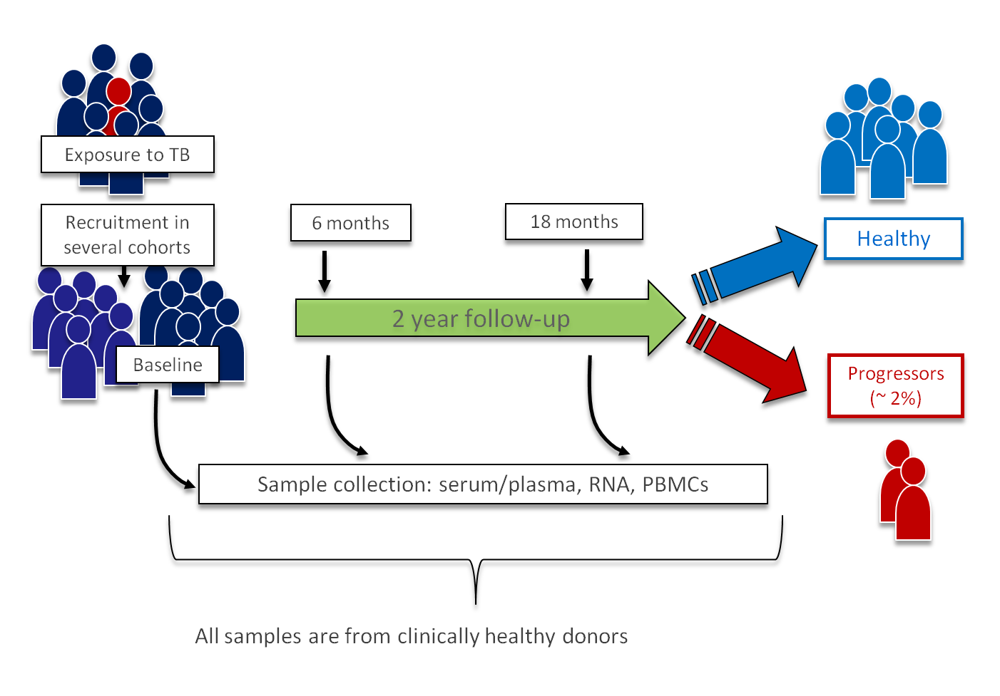
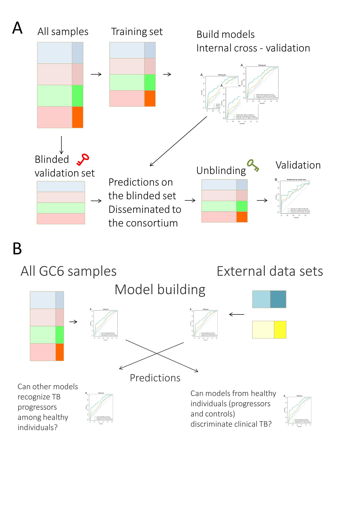

#' @include includes/calculations.rmd

# Supplementary Figures

**Supplementary Figure `r s_fig_scheme`.** *Design of the GC6 study. Participants were recruited
among household contacts of a TB index case in South Africa (SUN), The Gambia
(MRC), Ethiopia (AHRI) and Uganda (MAK).  Each participant was followed up for
2 years, and within that time, up to three samples have been collected.
Individuals who developed TB within three months after enrollment or with
concomitant diseases were excluded.  Participants who eventually developed TB
were considered progressors and compared to those who remained healthy during
the follow-up.*

[//]: # (\)


####

**Supplementary Figure `r s_fig_validation_scheme`.** *Validation scheme in
the study. **A**, scheme of the validation using a blinded hold-out
validation set. Training of the models was based on the unblinded training
set, and selected models were applied blindly to the validation set. **B**,
validation using external data sets from TB patients, healthy controls and
patients sufferning from other diseases. GC6 progressor models were tested
in the external data sets, and, vice versa, models based on external data
sets were tested in the GC6 data set.*



####

**Supplementary Figure `r s_fig_cv`.** *Receiver-operator characteristic (ROC) curves
showing the performance of all models in k-fold cross-validation within each
training sample set and each stratum. All models where trained on the training
data only and cross-validated using a 10-fold k-fold cross validation. TOT,
total model trained on all samples from all cohorts; MRC, SUN, AHRI and MAK,
models trained on samples from the respective sites; all, all samples;
proximate, samples closer than `r cutoff` months to diagnosis; distal, 
samples further than `r cutoff` from diagnosis.*

```{r s_fig_cv, fig.width=10, fig.height=7}
par(mfrow=c(2,3))
for(site in c("TOT", unique(set$SITE))) 
  plotROCseries(ss3_kfold[grepl(site, names(ss3_kfold))], 
  legend.names=c("all", "distal", "proximate"), positive.name="case", title=site)

```

#### 

**Supplementary Figure `r s_fig_cross_cohort`.** 
*Cross-validation of the models between the different sites using training
samples only. Each model was constructed using training set samples from a
given site, and then validated on all samples for another site.
*

```{r s_fig_cross_cohort, fig.width=9, fig.height=9}
par(mfrow=c(2,2))
for(s in 1:length(site.cross)) 
  plotROCseries(site.cross[[s]], 
    positive.name="case", title=gsub("\\.all", "", names(site.cross))[s])
```


#' -- #### 
#' -- 
#' -- **Supplementary Figure `r s_fig_cross_stype`.** *Heatmap showing the AUC in
#' -- a cross-validation between the different sample types.  Columns corresponds
#' -- to test sets and rows correspond to training sets. Colors correspond to the
#' -- AUC (see legend key in the top left corner). Each sample set from a given
#' -- site was tested as a whole (total) or stratified by time to disease
#' -- (proximate / distal).*
#' -- 
#' -- ```{r s_fig_cross_stype, fig.width=7, fig.height=7}
#' -- library(gplots)
#' -- cross.mat <- sapply(stype.cross, function(x) sapply(x, auc)[2,][names(stype.cross)])
#' -- rownames(cross.mat) <- names(stype.cross)
#' -- fcol <- colorRampPalette(c("black", "cyan"))
#' -- heatmap.2(cross.mat, symm=T, dendrogram="n", Rowv=F, Colv=F, trace="n", col=fcol, margins=c(8,8))
#' -- ```

####

**Supplementary Figure `r s_fig_pred_rev`.** 
*ROC curves showing the
performance of predictions of models based on the GC6 cohort when applied
to external data sets (TB-HEALTHY and TB-ORD).*

```{r s_fig_pred_rev, fig.width=6, fig.height=6}
series <- list(Metabo=pred.metabo.tot.rev$ret, TBORD=ord.rev.pred)
plotROCseries(series,
  legend.names=c("TB-HEALTHY (Weiner 2012)", "TB-ORD (this study)"), positive.name="case", title="Predictions on external data sets")
```

####

**Supplementary Figure `r s_fig_nvar`.** Internal performance of models
built on the TB-HEALTHY data set depending on the number of variables used.
For each number of variables, 100 random forest models were built. AUC of
the models is shown on the y axis, and number of variables on the x axis.
Vertical line indicates the chosen number of variables for the reduced model.

```{r s_fig_nvar,fig.width=10,fig.height=6}
boxplot(res.sim ~ col(res.sim), frame=F, xaxt="n", xlab="Number of variables", ylab="AUC", ylim=c(0.5, 1))
axis(1, labels=gsub("N\\.", "", colnames(res.sim)), at=1:ncol(res.sim))
abline(v=grep("N\\.10$", colnames(res.sim)), lty=2)
```

#' -- #### 

#' -- **Supplementary Figure `r s_fig_fd`.** XXX Placeholder -- Fergal's predictions
#' -- **A**, gbm_universal_loocvs predictions; **B**, gbm_universal_blind predictions

#' -- ```{r s_fig_fd,fig.width=8,fig.height=4}
#' -- fd_univ <- read.table("data/FD_gbm_universal_loocv_predictions.csv", sep=",", quote='"', header=T)
#' -- colnames(fd_univ) <- c("X", "prediction", "reality", "sampleID", "Site", "timeToTB", "donorID", "type", "TIMEPOINT", "MetabDonorID", "DonorID", "RnaID")
#' -- fd_univ$decision <- c("case", "control")[ (fd_univ$prediction < 0.5) + 1 ]
#' -- fd_blind <- read.table("data/FD_gbm_universal_blind_predictions.csv", sep=",", quote='"', header=T)
#' -- colnames(fd_blind) <- c("X", "prediction", "sampleID", "MetabDonorID.x", "Site", "reality", "timepoint", "sampleType", "MetabDonorID.y", "DonorID", "RnaID")
#' -- fd_blind$decision <- c("case", "control")[ (fd_blind$prediction < 0.5) + 1 ]
#' -- 
#' -- par(mfrow=c(1,2))
#' -- 
#' -- rocplot(fd_univ)
#' -- fig_label("A")
#' -- rocplot(fd_blind)
#' -- fig_label("B")
#' -- 
#' -- ```

#### 


#' --  **Supplementary Figure `r s_fig_profiles`.** 
#' --  *Raw value profiles of selected compounds
#' --  and loess fits showing changes in compounds in cases and controls. Purple,
#' --  cases; green, controls. 
#' --  Horizontal axis -- time to TB (for
#' --  progressors) or time to study discharge (for controls); vertical axis --
#' --  relative abundance. Each dot corresponds to one sample. Purple, progressors;
#' --  green, controls. Shaded area indicates 95% confidence intervals. Solid green line indicates
#' --  median for controls and dashed green lines indicate first and third quartiles for controls.*
#' -- 
#' -- 
#' --  ```{r s_fig_profiles,fig.width=10,fig.height=7,results="asis"}
#' -- selcomp <- unique(c(rownames(topTT(mod.1$fit, p.value=0.01)), rownames(topTT(mod.2$fit, p.value=0.01))))
#' --  selcomp <- unique(
#' --    c(rownames(lmer.res[ lmer.res$adj.P.Val < 0.001, ]),
#' --      rownames(glm.full[ glm.full$adj.P.Val < 0.01, ]),
#' --      rownames(glm.distal[ glm.full$adj.P.Val < 0.01, ]),
#' --      rownames(glm.proximate[ glm.full$adj.P.Val < 0.01, ]))
#' --  )
#' -- 
#' --  d <- 1
#' --  par(mfrow=c(2, 3))
#' --  for(i in selcomp) {
#' --    nn <- d %% 6
#' --    if(nn == 1) cat("\n\n####\n\n")
#' --    id <- LETTERS[(d - 1) %% 6 + 1]
#' --    cat(sprintf("\n%s. %s: %s; ", id, i, rg$genes[i, "BIOCHEMICAL"]))
#' --    loess.plot.bioch(i, rg, show.points=FALSE)
#' --    fig_label(id, cex=3)
#' --    d <- d + 1
#' --  }
#' --  ```

#### 

**Supplementary Figure `r s_fig_profiles_mod`.** 
*Normalized profiles of selected compounds
and loess fits showing changes in compounds in progressors and controls. 
Horizontal axis -- time to TB (for
progressors) or time to study discharge (for controls); vertical axis --
relative abundance. Shaded purple area indicates 95% confidence intervals. Solid green line indicates
median for controls and dashed green lines indicate first and third quartiles for controls.*


```{r s_fig_profiles_mod,fig.width=10,fig.height=7,results="asis"}
selcomp <- unique(
  c(rownames(lmer.res[ lmer.res$adj.P.Val < 0.001, ]),
    rownames(glm.full[ glm.full$adj.P.Val < 0.01, ]),
    rownames(glm.distal[ glm.full$adj.P.Val < 0.01, ]),
    rownames(glm.proximate[ glm.full$adj.P.Val < 0.01, ]))
)


d <- 1
par(mfrow=c(2, 3))
for(i in selcomp) {
  nn <- d %% 6
  if(nn == 1) cat("\n\n####\n\n")
  id <- LETTERS[(d - 1) %% 6 + 1]
  cat(sprintf("\n%s. %s: %s; ", id, i, gsub("\\*", "", rg$genes[i, "BIOCHEMICAL"])))
  if(d %% 6 == 0) cat("\n\n")
  loess.plot.bioch(i, rg, data=mod, show.points=FALSE)
  fig_label(id, cex=3)
  d <- d + 1
}
```


#### 

**Supplementary Figure `r s_fig_smoking`.**  *Smoking status and cotinine
levels. 
*A*, number of smokers by study site. Grey, no data available; blue,
smokers; mustard, non-smokers; green, individuals reporting to have quit
smoking; 
*B*, 
cotinine levels and smoking status (> 6M, more than six months since quitting smoking; < 6M, less than six months since quitting); 
*C*, 
cotinine levels and smoking frequency (in cigarettes per day; N.a. -- not
applicable to non-smokers);
*D*, 
cotinine levels and smoking duration (in years; N.a. -- not applicable to
non-smokers).*

```{r s_fig_smoking, fig.width=12, fig.height=12}
par(mfrow=c(2,2))


col <- c(mypalette()[c(5,3,2,1)], "grey")
barplot(table(set$SMOKE, set$SITE, useNA="ifany"), col=col )
legend("topleft", c( levels(set$SMOKE), "Unknown"), col=col, bty="n", pch=15)
mtext("A", side=3, line=2, adj=0, cex=2)

i <- "M.553"
tmp <- tapply(rg$E[i,], rg$targets$DONOR_ID, mean)
tmp <- tmp[ donors$DONOR_ID ]

myvioplot(tmp, donors$SMOKE, col="grey", border=F, ylab="Level of cotinine", main="Smoking status")
mtext("B", side=3, line=2, adj=0, cex=2)

myvioplot(tmp, donors$FSMOKE, col="grey", border=F, ylab="Level of cotinine", main="Frequency of smoking")
mtext("C", side=3, line=2, adj=0, cex=2)

myvioplot(tmp, donors$SMOKEYRS, col="grey", border=F, ylab="Level of cotinine", main="Duration of smoking")
mtext("D", side=3, line=2, adj=0, cex=2)

```

#### 


# Supplementary Tables

**Supplementary Table `r s_tab_recruitment`.** GC6-74 recruitment and follow up dates.

----------------------------------------------------------------------------------------------------------------------------------------------------------------------------
**Country**    **Institution**  **First date of enrolment** **Last date of enrolment** **Last date of follow-up** **Number of Index cases** **Number of Household Contacts**
-------------- ---------------- --------------------------- -------------------------- -------------------------- ------------------------- ---------------------------------
South Africa   SUN              February 27th, 2006         December 14th, 2010        November 28th, 2012        209                       1,197

The Gambia     MRC              March 5th, 2007             October 21st, 2010         October 22nd, 2012         402                       1,948

Uganda         MAK              June 1st, 2006              June 8th, 2010             May 4th, 2012              181                       499

Ethiopia       AHRI             February 12th, 2007         August 3rd, 2011           August 16th, 2012          154                       818
----------------------------------------------------------------------------------------------------------------------------------------------------------------------------

####

**Supplementary Table `r s_tab_criteria`.** Criteria for tuberculosis diagnosis in GC6-74 progressors.


Category      |Culture 1     |Culture 2^†^  |AFB 1         |AFB 2^†^      |CXR           |Symptoms      |TB Treatment Response|Failed AB       |New Class
--------------|--------------|--------------|--------------|--------------|--------------|--------------|---------------------|----------------|--------------
A             |+             |+             |              |              |              |              |                     |                | Definite                                                    
B             |+             |              |              |              |+             |              |                     |                | Definite                                                    
C             |+             |              |+             |              |              |              |                     |                | Definite                                                    
D             |              |              |+             |+             |+             |              |                     |                | Probable                                                    
E             |              |              |+             |+             |              |+             |                     |                | Probable                                                    
F             |              |              |+             |              |+             |              |                     |                | Probable                                                    
G             |+             |              |              |              |              |+             |+                    |                | Probable                                                    
H             |+             |              |              |              |              |+             |                     |                | Possible                                                    
I             |              |              |+             |+             |              |              |+                    |                | Possible                                                    
J             |              |              |+             |              |              |+             |                     |                | Possible                                                    
K             |              |              |              |              |+             |+             |+                    |   +            | Possible                                                    
L             |+             |              |              |              |              |              |                     |                | Questionable                                                
M             |              |              |+             |+             |              |              |                     |                | Questionable                                                
N             |              |              |+             |              |              |              |                     |                | Questionable                                                
O             |              |              |              |              |+             |+             |                     |                | Questionable                                                
P             |              |              |              |              |+             |              |                     |                | Questionable                                                
Q             |              |              |              |              |              |+             |                     |                | Questionable                                                
R             |Neg/ND        |Neg/ND        |Neg/ND        |Neg/ND        |Neg/ND        |+             |Rx not started       |                | Non-TB case                                                 
S             |Neg/ND        |Neg/ND        |Neg/ND        |Neg/ND        |Neg/ND        |Neg/ND        |Rx not started       |                | Non-TB case                                                 


Culture
  ~ Either liquid or solid agar positive with confirmed speciation for M.tuberculosis complex

AFB
  ~ Acid-fast bacilli: sputum smear ≥scanty (≥1-9 acid-fast organisms per 100x oil field)

CXR
  ~ Chest X-ray compatible with active TB

Failed AB
  ~ Failed antibiotics treatment; no response of symptoms to a 7-day, broad spectrum oral or IV antibiotics

†
  ~ Positivity on a separate sample of culture or AFB (not an aliquot of the same sample) provided by the participant preferrably but not necessarily on separate days

Note: Questionable classification is excluded in both progressors and non-progressors (controls)


####

**Supplementary Table `r s_tab_approvals`.** Institutional Review Boards that provided ethics approvals for the different GC6-74 sites

---------------------------------------------------------------------------------
**Institution**   **Country**     **Ethics Review Committee**   **Protocol no.**
----------------- --------------- ----------------------------- -----------------
SUN               South Africa    Stellenbosch University       N05/11/187
                                  Institutional Review Board

MRC               The Gambia      Joint Medical Research        SCC.1141vs2
                                  Council and Gambian
                                  Government

MAK               Uganda          Uganda National Council for   MV 715
                                  Science and Technology

MAK               Uganda          University Hospitals Case     12-95-08
                                  Medical Centre

AHRI              Ethiopia        Armauer Hansen Research       P015/10
                                  Institute (AHRI)/All Africa
                                  Leprosy, TB and
                                  Rehabilitation Training
                                  Center (ALERT)

UCT               South Africa    University of Cape Town       013/2013
                                  Human Research Ethics
                                  Committee HREC
---------------------------------------------------------------------------------

####

**Supplementary Table `r s_tab_tst`.** Summary of the results of the
tuberculin skin test (TST) at the baseline and study end. Numbers of
persons with the result of TST greater than 10 mm are stratified by the
GC-74 sites.

```{r s_tab_tst,results="markup"}

sel <- set$TIMEPOINT == "BL"
bl_tst_pos <- tapply(set$TST[sel], set$DONOR_ID[sel], max) >= 10
bl_tst_nd  <- tapply(set$TST[sel], set$DONOR_ID[sel], function(x) all(x == -99))

any_tst_pos <- tapply(set$TST, set$DONOR_ID, max) >= 10
any_tst_nd  <- tapply(set$TST, set$DONOR_ID, function(x) all(x == -99))

tmp <- sapply(unique(donors$SITE), function(site) {
  sel <- donors$DONOR_ID[ donors$SITE == site & donors$CASE_CONTROL == "control" ]
  n <- length(sel)
  n_bl <- sum(bl_tst_pos[ names(bl_tst_pos) %in% sel ])
  n_any <- sum(any_tst_pos[ names(any_tst_pos) %in% sel ])

  c(
    BL=sprintf("%d (%.1f %%)", n_bl, 100 * n_bl / n),
    ANY=sprintf("%d (%.1f %%)", n_any, 100 * n_any/n)
  )
})

tmp <- t(tmp)
colnames(tmp) <- c("Baseline", "Any time point")
rownames(tmp) <- c(SUN="South Africa", MRC="The Gambia", MAK="Uganda", AHRI="Ethiopia")[ rownames(tmp) ]
pander(tmp)

```


####

**Supplementary Table `r s_tab_sample_types`.** Sample types by cohort.
*P*, progressors, *C*, controls.
#' -- stab 4

```{r s_tab_sample_types,results="markup"}
tmp <- table(set$SITE, set$SAMPLE_TYPE)
sel <- set$group == "case"
tmp2 <- table(set$SITE[sel], set$SAMPLE_TYPE[sel])
tmp3 <- table(set$SITE[!sel], set$SAMPLE_TYPE[!sel])
res <- matrix(sprintf("%d (P=%d, C=%d)", tmp, tmp2, tmp3), nrow=4, byrow=F)
res[ grep("^0", res) ] <- ""
colnames(res) <- c( "Plasma", "Plasma/RPMI", "Serum")
rownames(res) <- rownames(tmp)
pander(res, justify="left")
```

#### 
#' -- stab 5

**Supplementary Table `r s_tab_kfold`.** Performance of the different
machine learning models in internal k-fold cross-validation within the
training data sets. 
The models were trained and evaluated on the training data set.  *Site*,
the name of the site from which the samples were used; *Timepoints*, the
selected timepoints, either all samples, or samples close (proximate) to the
diagnoses, or samples further away (distal) from the diagnosis (see column
2). *AUC*, Area Under Curve; *CI*, 95% confidence interval; *p-value*,
p-value associated with the AUC; *q-value*, p-value adjusted with the
Benjamini-Hochberg procedure;
*PPV*, positive predictive value; *NPV*, negative predictive value; 
*SENS*, sensitivity at 0.75 specificity;
*PPV^2^* and *NPV^2^*: PPV and NPV assuming 2% prevalence and at 0.75 sensitivity;
*N*, number of features used in the model.

```{r s_tab_kfold,results="markup"}
panderOptions('digits', 2)
#tmp <- rocseriestable(ss3_kfold)
tmp <- rocseriestable.fmt(ss3_kfold.tab)
rownames(tmp) <- NULL
tmp$star <- NULL
sel <- tmp$q.value < 0.05
tmp$q.value <- p.adjust(tmp$p.value)
sel <- tmp$q.value < 0.05

tmp <- data.frame(Site=gsub("\\..*", "", tmp$name),
                  Timepoints=gsub(".*\\.", "", tmp$name),
                  tmp[,-1])
tmp$Site[ duplicated(tmp$Site) ] <- ""
tmp$Site <- gsub("Late", "Distal", tmp$Site)

colnames(tmp) <- c("Site", "Timepoints", "AUC", "p-value", "q-value", "PPV", "NPV", "SENS", "PPV^2^", "NPV^2^", "N")
pander(tmp, split.cells=Inf, split.tables=Inf, missing="", justify="left", emphasize.strong.cells=cbind(which(sel), 5))
```

#### 
#' -- stab 6

**Supplementary Table `r s_tab_sitecross`.** Performance of the 
machine learning tested cross-wise between cohorts within the training set.
The models were trained and evaluated only on the training data set.  *Train*,
the name of the site from which the samples were used for testing; *Test*, name of the 
site on which the given model was tested. *AUC*, Area Under Curve; *CI*, 95% confidence interval; *p-value*,
p-value associated with the AUC; *q-value*, p-value adjusted with the
Benjamini-Hochberg procedure;
*PPV*, positive predictive value; *NPV*, negative predictive value; 
*SENS*, sensitivity at 0.75 specificity;
*PPV^2^* and *NPV^2^*: PPV and NPV assuming 2% prevalence and at 0.75
sensitivity; *N*, number of features in a model-test set combination.

```{r s_tab_sitecross,results="markup"}
panderOptions('digits', 2)
 
load("static_cache/site_cross.rda")
tmp <- sapply(names(site.cross), function(n) cbind(n, rocseriestable(site.cross[[n]])), simplify=F)
tmp <- rocseriestable.fmt(Reduce(rbind, tmp))
tmp$n[ duplicated(tmp$n) ] <- ""
tmp$n <- gsub("\\.all", "", tmp$n)
tmp$name <- gsub("\\.all", "", tmp$name)
tmp$q.value <- p.adjust(tmp$p.value)

nvars <- sapply(unlist(site.cross, recursive=F), function(x) attr(x, "nvar"))
tmp$Nvar <- nvars

rownames(tmp) <- NULL
tmp$star <- NULL
sel <- tmp$q.value < 0.05

colnames(tmp) <- c("Train", "Test", "AUC", "p-value", "q-value", "PPV", "NPV", "SENS", "PPV^2^", "NPV^2^", "N")
pander(tmp, split.cells=Inf, split.tables=Inf, missing="", justify="left", emphasize.strong.cells=cbind(which(sel), 5))
```

#### 
#' -- stab 7

**Supplementary Table `r s_tab_samplecross`.** Performance of the 
machine learning tested cross-wise between sample types within the training
set.
The models were trained and evaluated only on the training data set.  *Train*,
sample type from which the samples were used for testing; *Test*, name of the 
site on which the given model was tested. *AUC*, Area Under Curve; *CI*, 95% confidence interval; *p-value*,
p-value associated with the AUC; *q-value*, p-value adjusted with the
Benjamini-Hochberg procedure;
*PPV*, positive predictive value; *NPV*, negative predictive value; 
*SENS*, sensitivity at 0.75 specificity;
*PPV^2^* and *NPV^2^*: PPV and NPV assuming 2% prevalence and at 0.75 sensitivity; *N*, number of features in a model-test set combination.


```{r s_tab_samplecross,results="markup"}
panderOptions('digits', 2)

tmp <- sapply(names(stype.cross), 
  function(xn) { x <- stype.cross[[xn]] ; 
                 x <- x[ grep("all", names(x)) ] ; 
                 nvars <- sapply(x, function(xx) attr(xx, "nvar"))
                 ret <- data.frame(train=xn, rocseriestable(x), nvar=nvars) ; }, simplify=F)
tmp <- Reduce(rbind, tmp)
tmp <- rocseriestable.fmt(tmp)
tmp <- data.frame(sample=gsub("\\..*", "", tmp$train), tmp)
tmp$train[ duplicated(tmp$train) ] <- ""
tmp$train <- gsub("(plasma|serum|rpmi)\\.", "", tmp$train)
tmp$sample[ duplicated(tmp$sample) ] <- ""
tmp$name <- gsub("\\.all", "", tmp$name)
sel <- cbind(which(tmp$q.value < 0.05), which(colnames(tmp) == "q.value"))
rownames(tmp) <- NULL
colnames(tmp) <- c("Train", "Subset", "Test", "AUC", "p-value", "q-value", "PPV", "NPV", "SENS", "PPV^2^", "NPV^2^", "N")
pander(tmp, split.cells=Inf, split.tables=Inf, missing="", justify="left", emphasize.strong.cells=sel)
```

#### 

**Supplementary Table `r s_tab_topcompounds`.** The top 25 compounds (by
mean decrease in accuracy) in the models Total and Total/BL. 
*Mean decrease*: mean decrease in accuracy.

```{r s_tab_topcompounds,results="markup"}
top_total    <- rownames(rf.total$importance)[order(-rf.total$importance[,3])][1:25]
top_total_bl <- rownames(rf.total.bl$importance)[order(-rf.total.bl$importance[,3])][1:25]

cols <- c("ID", "BIOCHEMICAL")
tmp <- rbind(
  data.frame(model="Total", all.biochemicals[ top_total, cols ], md=rf.total$importance[top_total, 3]),
  data.frame(model="Total/BL", all.biochemicals[ top_total_bl, cols ], md=rf.total.bl$importance[top_total_bl, 3])
  )
colnames(tmp) <- c("Model", "ID", "Name", "Mean decrease")
tmp$Model[ duplicated(tmp$Model) ] <- ""

pander(tmp, split.cells=Inf, split.tables=Inf, missing="", justify="left")


```


#### 
#' -- stab 8

**Supplementary Table `r s_tab_unblinding`.** Performance of the different
machine learning models on the blinded data sets. All ML models
were trained on the training data set.  *Model*, the name of the model
applied either to all samples, or samples close (proximate) to the
diagnoses, or samples further away (distal) from the diagnosis (see column
2). *AUC*, Area Under Curve; *CI*, 95% confidence interval; *p-value*,
p-value associated with the AUC; *q-value*, p-value adjusted with the
Benjamini-Hochberg procedure;
*PPV*, positive predictive value; *NPV*, negative predictive value; 
*SENS*, sensitivity at 0.75 specificity;
*PPV^2^* and *NPV^2^*: PPV and NPV assuming 2% prevalence and at 0.75
sensitivity; *N*, number of features.

```{r s_tab_unblinding,results="markup"}
panderOptions('digits', 2)
tmp <- rocseriestable.fmt(pred.full.tab)
rownames(tmp) <- NULL
tmp$star <- NULL
tmp$q.value <- p.adjust(tmp$p.value)
sel <- tmp$q.value < 0.05
tmp$N <- pred.nvars$N[ match(gsub("\\.[^.]*$", "", tmp$name), pred.nvars$ID) ]

tmp <- data.frame(Model=gsub("\\.", " ", gsub("(.*)\\.[^\\.]*$", "\\1", tmp$name)), 
                  Timepoint=gsub(".*\\.([^\\.]*)$", "\\1", tmp$name),
                  tmp[,-1])
tmp$N[ duplicated(tmp$Model) ] <- ""
tmp$Model[ duplicated(tmp$Model) ] <- ""
tmp$Model <- gsub("Late", "Distal", tmp$Model)

colnames(tmp) <- c("Model", "Timepoints", "AUC", "p-value", "q-value", "PPV", "NPV", "SENS", "PPV^2^", "NPV^2^", "N")
pander(tmp, split.cells=Inf, split.tables=Inf, missing="", justify="left", emphasize.strong.cells=cbind(which(sel), 5))
```

####

**Supplementary Table `r s_tab_unblinding_bysite`.** Performance of the 
machine learning models "Total" and "Total.BL" on the blinded data sets, stratified by site. All ML models
were trained on the training data set.  *Model*, the name of the model
applied all samples from one of the four cohorts; *Site*, the subset of samples on which
the model was evaluated. *AUC*, Area Under Curve; *CI*, 95% confidence interval; *p-value*,
p-value associated with the AUC; *q-value*, p-value adjusted with the
Benjamini-Hochberg procedure;
*PPV*, positive predictive value; *NPV*, negative predictive value; 
*SENS*, sensitivity at 0.75 specificity;
*PPV^2^* and *NPV^2^*: PPV and NPV assuming 2% prevalence and at 0.75 sensitivity. 
The number of features is given in Supplementary Table `r s_tab_unblinding`.

```{r s_tab_unblinding_bysite,results="markup"}
panderOptions('digits', 2)
tmp <- rocseriestable.fmt(pred.bysite.tab)
rownames(tmp) <- NULL
tmp$star <- NULL
tmp$q.value <- p.adjust(tmp$p.value)
sel <- tmp$q.value < 0.05

tmp <- data.frame(Model=gsub("\\.", " ", gsub("(.*)\\.[^\\.]*$", "\\1", tmp$name)), 
                  Site=gsub(".*\\.([^\\.]*)$", "\\1", tmp$name),
                  tmp[,-1])
tmp$Model[ duplicated(tmp$Model) ] <- ""
tmp$Model <- gsub("Late", "Distal", tmp$Model)

colnames(tmp) <- c("Model", "Site", "AUC", "p-value", "q-value", "PPV", "NPV", "SENS", "PPV^2^", "NPV^2^")
pander(tmp, split.cells=Inf, split.tables=Inf, missing="", justify="left", emphasize.strong.cells=cbind(which(sel), 5))
```


#### 

**Supplementary Table `r s_tab_metabo_performance`.** Performance of the TB-HEALTHY model 
with `r nrow(mod.metabo.full$importance)` features
when applied to GC6 data. *AUC*, area under curve; 
in parentheses, 95% confidence intervals; 
p-value for the AUC;
q-value: p-value corrected using the Benjamini-Hochberg method;
*PPV*, positive predictive value; *NPV*, negative predictive value; 
*SENS*, sensitivity at 0.75 specificity;
*PPV^2^* and *NPV^2^*: PPV and NPV assuming 2% prevalence and at 0.75 sensitivity. 

```{r s_tab_metabo_performance,results="markup"}
panderOptions('digits', 2)
tmp <- rocseriestable.fmt(pred.metabo.tab)
tmp <- tmp[ grep("full", tmp$name), ]
rownames(tmp) <- NULL
tmp$star <- NULL
tmp$q.value <- p.adjust(tmp$p.value)
sel <- tmp$q.value < 0.05

tmp$name <- gsub("\\.full$", "", tmp$name)
tmp <- data.frame(Site=tmp[,1], tmp)
tmp[,1] <- gsub("\\..*", "", tmp[,1])
tmp[ duplicated(tmp[,1]), 1] <- ""
tmp$name <- gsub(".*\\.", "", tmp$name)
colnames(tmp) <- c("Site", "Model", "AUC", "p-value", "q-value", "PPV", "NPV", "SENS", "PPV^2^", "NPV^2^")

pander(tmp, split.cells=Inf, split.tables=Inf, missing="", justify="left", emphasize.strong.cells=cbind(which(sel), 5))
```

#### 

**Supplementary Table `r s_tab_metabo_red`.** Performance of the shrinked TB-HEALTHY model 
with 10 features
when applied to GC6 data. *AUC*, area under curve; 
in parentheses, 95% confidence intervals; 
p-value for the AUC;
q-value: p-value corrected using the Benjamini-Hochberg method;
*PPV*, positive predictive value; *NPV*, negative predictive value; 
*SENS*, sensitivity at 0.75 specificity;
*PPV^2^* and *NPV^2^*: PPV and NPV assuming 2% prevalence and at 0.75 sensitivity. 

```{r s_tab_metabo_red,results="markup"}
panderOptions('digits', 2)
tmp <- rocseriestable.fmt(pred.metabo.tab)
tmp <- tmp[ grep("shrinked", tmp$name), ]
rownames(tmp) <- NULL
tmp$star <- NULL
tmp$q.value <- p.adjust(tmp$p.value)
sel <- tmp$q.value < 0.05

tmp$name <- gsub("\\.shrinked$", "", tmp$name)
tmp <- data.frame(Site=tmp[,1], tmp)
tmp[,1] <- gsub("\\..*", "", tmp[,1])
tmp[ duplicated(tmp[,1]), 1] <- ""
tmp$name <- gsub(".*\\.", "", tmp$name)
colnames(tmp) <- c("Site", "Model", "AUC", "p-value", "q-value", "PPV", "NPV", "SENS", "PPV^2^", "NPV^2^")

pander(tmp, split.cells=Inf, split.tables=Inf, missing="", justify="left", emphasize.strong.cells=cbind(which(sel), 5))
```


#### 

**Supplementary Table `r s_tab_tbord_performance`.** Performance of the TB-ORD model 
with `r nrow(mod.jayne.full$importance)` features when applied to GC6 data. *AUC*, area under curve; *CI*, 95% confidence interval for the AUC; *p-value*, 
p-value for the AUC;
*q-value*, p-value corrected using the Benjamini-Hochberg method; *PPV*,
positive predictive value for optimal threshold; *NPV*, negative predictive
value; *SENS*, sensitivity at 0.75 specificity;
*PPV^2^* and *NPV^2^*: PPV and NPV assuming 2% prevalence and at 0.75 sensitivity.

```{r s_tab_tbord_performance,results="markup"}
panderOptions('digits', 2)
tmp <- rocseriestable.fmt(rocseriestable(pred.jayne))
rownames(tmp) <- NULL
tmp$star <- NULL
tmp$q.value <- p.adjust(tmp$p.value)
sel <- tmp$q.value < 0.05

tmp <- data.frame(Site=tmp[,1], tmp)
tmp[,1] <- gsub("\\..*", "", tmp[,1])
tmp[ duplicated(tmp[,1]), 1] <- ""
tmp$name <- gsub(".*\\.", "", tmp$name)

colnames(tmp) <- c("Site", "Model", "AUC", "p-value", "q-value", "PPV", "NPV", "SENS", "PPV^2^", "NPV^2^")

pander(tmp, split.cells=Inf, split.tables=Inf, missing="", justify="left", emphasize.strong.cells=cbind(which(sel), 5))
```

####

**Supplementary Table `r s_tab_diff_res`.** Q-values (p-values corrected using the
Benjamini-Hochberg method) in the
differential metabolite analysis. The table shows only the identified
metabolites which achieved a q-value lower than 0.01 in one of the two models
tested when comparing progressors with controls. *Proximate*, model including only
proximate samples (collected within `r cutoff` months of TB diagnosis); *Full*, model
including all samples. Enries show odds ratios (*OR*) with 95% confidence
intervals and q values corrected for multiple testing using the
Benjamini-Hochberg method.

```{r tab_diff_res,results="markup"}
tmp <- data.frame(ID=rownames(glm.full))
tmp$Name  <- all.biochemicals[ tmp$ID, "BIOCHEMICAL" ]
tmp$Name  <- gsub("\\*", "", tmp$Name)
tmp$Group <- all.biochemicals[ tmp$ID, "SUPER.PATHWAY" ]
tmp$Proximate <- with(glm.proximate, sprintf("%.2f (%.2f-%.2f)", OR, CI.L, CI.R))
tmp$q         <- with(glm.proximate, adj.P.Val)
tmp$Full      <- with(glm.full,      sprintf("%.2f (%.2f-%.2f)", OR, CI.L, CI.R))
tmp[,"q "]    <- with(glm.full, adj.P.Val)
                  
pval.cutoff <- 0.01
sel <- (glm.full$adj.P.Val < pval.cutoff | glm.proximate$adj.P.Val < pval.cutoff) & !  grepl("X - ", tmp$Name)
tmp <- tmp[sel,]

#tmp <- tmp[ !is.na(tmp$Group) & tmp$Group != "", ]
tmp[ tmp$Group == "Lipid", ]$Group <- "Lipid and lipid-like molecules"
selc <- c("q", "q " )
tmp[,selc] <- apply(tmp[ , selc], 2, function(x) signif(x, digits=2))
tmp <- tmp[ order(tmp$Group), ]
tmp$Group[ duplicated(tmp$Group) ] <- " ,, "
pander(tmp, split.cells=Inf, split.tables=Inf, missing="", row.names=FALSE,
  emphasize.strong.cells=which(tmp < 0.05, arr.ind=TRUE), justify="left")

```

#### 
**Supplementary Table `r s_tab_timecourse`.** Significant (q < 0.001)
results of the regression in progressors over time to diagnosis. *ΔBIC*,
difference in Bayesian Information Criterion between the null model and the full model including
time to TB; *f^2^*, Cohen's f^2^ effect size measure; *q*,
p-value of likelihood ratio test corrected for multiple testing using the
Benjamini-Hochberg method.

```{r tab_timecourse,results="markup"}
tmp <- data.frame(ID=rownames(lmer.res))
tmp$Name  <- all.biochemicals[ tmp$ID, "BIOCHEMICAL" ]
tmp$Name  <- gsub("\\*", "", tmp$Name)
tmp$Group <- all.biochemicals[ tmp$ID, "SUPER.PATHWAY" ]
tmp <- data.frame(tmp, "daic"=signif(lmer.res$BIC.1-lmer.res$BIC.2, 2), 
                        signif(lmer.res[, c("F2", "adj.P.Val")], 2))
colnames(tmp) <- c("ID", "Name", "Group", "ΔBIC", "f^2^", "q")
tmp <- tmp[ tmp$q < 0.001, ]
tmp <- tmp[ !grepl("^X - ", tmp$Name), ]
tmp <- tmp[ order(tmp$q), ]
tmp <- tmp[ order(tmp$Group), ]
tmp <- tmp[ tmp$Group != "", ] 
tmp$Group[ duplicated(tmp$Group) ] <- " ,, "
pander(tmp, split.cells=Inf, split.tables=Inf, missing="", row.names=FALSE,
  #emphasize.strong.cells=which(tmp < 0.05, arr.ind=TRUE), 
  justify="left")
```

#### 

**Supplementary Table `r s_tab_lmer_enr`.** Results of the enrichment
analysis for the time course regression. ID, identifier of the cluster or
metabolite set; Name, name of the cluster or metabolite set; *AUC*, area
under curve; *q*, p-value for the U statistic of the AUC adjusted for
multiple testing using the Benjamini-Hochberg method.

```{r s_tab_lmer_enr,results="markup"}
tmp <- lmer.enr.res[ , c("ID", "Title", "AUC", "adj.P.Val") ]
tmp[ , c("AUC", "adj.P.Val") ] <- signif(tmp[ , c("AUC", "adj.P.Val") ], 2)
colnames(tmp) <- c("ID", "Name", "AUC", "q")
pander(tmp, split.cells=Inf, split.tables=Inf, missing="", row.names=FALSE,
  emphasize.strong.cells=which(tmp < 0.05, arr.ind=TRUE), justify="left")


```


#### 

**Supplementary Table `r s_tab_sessionInfo`.** Detailed information on the computing
environment used to perform the analyses (sessionInfo() output).

```{r s_tab_sessionInfo,results="markup"}
sessionInfo()
```


